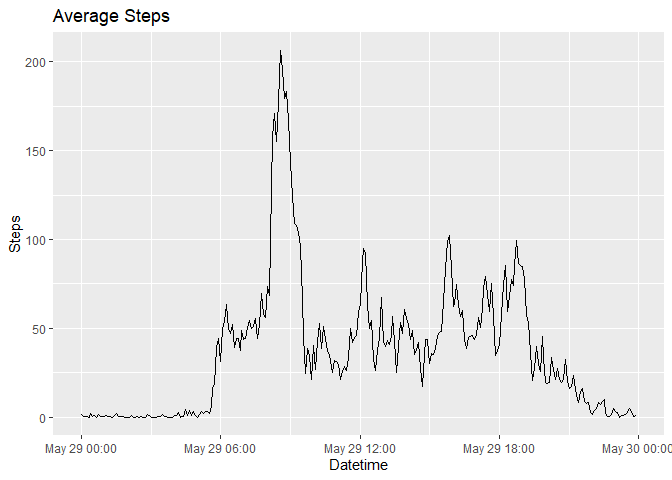
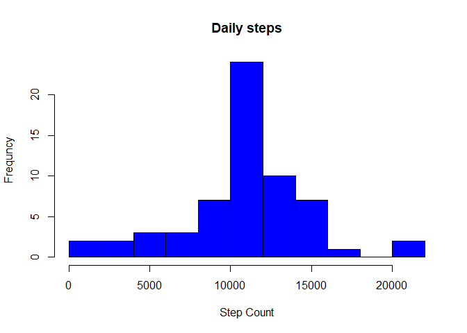

    knitr::opts_chunk$set(echo = TRUE,message=FALSE, warning=FALSE)

Loading Packages
----------------

    library(ggplot2)
    library(dplyr)
    library(lubridate)
    library(tidyr)

Loading Data into environment
-----------------------------

    url<-"https://d396qusza40orc.cloudfront.net/repdata%2Fdata%2Factivity.zip"

    download.file(url, destfile="Activity_monitoring_data.zip")
    unzip("Activity_monitoring_data.zip")
    Activity_data <- read.csv("activity.csv")

What is mean total number of steps taken per day?
-------------------------------------------------

1.  Calculate the total number of steps taken per day

<!-- -->

    activity_by_day<-Activity_data %>%
      group_by((date))%>% 
      summarise(steps=sum(steps,na.rm=TRUE))

1.  Make a histogram of the total number of steps taken each day

<!-- -->

    plot1<-hist(activity_by_day$steps,
                main="Daily steps",
                xlab = "Step Count", 
                ylab="Frequncy",
                breaks = 10, 
                col = 'blue')

    print(plot1) 

    ## $breaks
    ##  [1]     0  2000  4000  6000  8000 10000 12000 14000 16000 18000 20000
    ## [12] 22000
    ## 
    ## $counts
    ##  [1] 10  2  3  3  7 16 10  7  1  0  2
    ## 
    ## $density
    ##  [1] 8.196721e-05 1.639344e-05 2.459016e-05 2.459016e-05 5.737705e-05
    ##  [6] 1.311475e-04 8.196721e-05 5.737705e-05 8.196721e-06 0.000000e+00
    ## [11] 1.639344e-05
    ## 
    ## $mids
    ##  [1]  1000  3000  5000  7000  9000 11000 13000 15000 17000 19000 21000
    ## 
    ## $xname
    ## [1] "activity_by_day$steps"
    ## 
    ## $equidist
    ## [1] TRUE
    ## 
    ## attr(,"class")
    ## [1] "histogram"

    dev.off()

    ## null device 
    ##           1

1.  Calculate and report the mean and median of the total number of
    steps taken per day

<!-- -->

    Activity_data %>%
        group_by((date))%>% 
        summarise(steps=sum(steps,na.rm=TRUE))%>%
        summarise(mean=mean(steps,na.rm=TRUE),median=median(steps,na.rm=TRUE))

    ## # A tibble: 1 x 2
    ##    mean median
    ##   <dbl>  <int>
    ## 1 9354.  10395

\#\#What is the average daily activity pattern?

Make a time series plot (i.e. type = “l”) of the 5-minute interval
(x-axis) and the average number of steps taken, averaged across all days
(y-axis)

    activity_mean_interval<-Activity_data %>%
      group_by(interval)%>% 
      summarise(steps=mean(steps,na.rm=TRUE))

    activity_mean_interval$time<- as.character(activity_mean_interval$interval)
    for (i in 1:2){
      activity_mean_interval$time[i] <- as.character(paste0("0",activity_mean_interval$time[i]))
    }
    for (i in 1:12){
      activity_mean_interval$time[i] <- as.character(paste0("00",activity_mean_interval$time[i]))
    }
    for (i in 13:120){
      activity_mean_interval$time[i] <- as.character(paste0("0",activity_mean_interval$time[i]))
    }
    activity_mean_interval$time <- as.POSIXct(activity_mean_interval$time, format = "%H%M")

    plot2 <-ggplot(activity_mean_interval, aes(x=time, y=steps)) +
           geom_line() + 
          xlab("Datetime") +
          ylab("Steps")+
          ggtitle("Average Steps")
    plot2

    dev.off()

    ## null device 
    ##           1

Which 5-minute interval, on average across all the days in the dataset,
contains the maximum number of steps

    filter(activity_mean_interval,steps==max(steps))

    ## # A tibble: 1 x 3
    ##   interval steps time               
    ##      <int> <dbl> <dttm>             
    ## 1      835  206. 2020-05-29 08:35:00

\#\#Imputing missing values 1.Calculate and report the total number of
missing values in the dataset (i.e. the total number of rows with NAs)

    sum(is.na(Activity_data$steps))

    ## [1] 2304

1.  Devise a strategy for filling in all of the missing values in the
    dataset. The strategy does not need to be sophisticated. For
    example, you could use the mean/median for that day, or the mean for
    that 5-minute interval, etc.

2.  Create a new dataset that is equal to the original dataset but with
    the missing data filled in.

<!-- -->

    activity_no_na<-Activity_data

    x<-mean(activity_no_na$steps,na.rm=TRUE)
    activity_no_na$steps<-replace_na(activity_no_na$steps,x)

1.  Make a histogram of the total number of steps taken each day and
    Calculate and report the mean and median total number of steps taken
    per day. Do these values differ from the estimates from the first
    part of the assignment? What is the impact of imputing missing data
    on the estimates of the total daily number of steps?

<!-- -->

    activity_by_day_no_na<-activity_no_na %>%
      group_by(date)%>% 
      summarise(steps=sum(steps,na.rm=TRUE))

    plot1<-hist(activity_by_day_no_na$steps,
                main="Daily steps",
                xlab = "Step Count", 
                ylab="Frequncy",
                breaks = 10, 
                col = 'blue')

    print(plot1) 

    ## $breaks
    ##  [1]     0  2000  4000  6000  8000 10000 12000 14000 16000 18000 20000
    ## [12] 22000
    ## 
    ## $counts
    ##  [1]  2  2  3  3  7 24 10  7  1  0  2
    ## 
    ## $density
    ##  [1] 1.639344e-05 1.639344e-05 2.459016e-05 2.459016e-05 5.737705e-05
    ##  [6] 1.967213e-04 8.196721e-05 5.737705e-05 8.196721e-06 0.000000e+00
    ## [11] 1.639344e-05
    ## 
    ## $mids
    ##  [1]  1000  3000  5000  7000  9000 11000 13000 15000 17000 19000 21000
    ## 
    ## $xname
    ## [1] "activity_by_day_no_na$steps"
    ## 
    ## $equidist
    ## [1] TRUE
    ## 
    ## attr(,"class")
    ## [1] "histogram"

    dev.off()

    ## null device 
    ##           1

    activity_no_na %>%
      group_by((date))%>%
      summarise(mean=mean(steps,na.rm=TRUE),median=median(steps,na.rm=TRUE))

    ## # A tibble: 61 x 3
    ##    `(date)`     mean median
    ##    <fct>       <dbl>  <dbl>
    ##  1 2012-10-01 37.4     37.4
    ##  2 2012-10-02  0.438    0  
    ##  3 2012-10-03 39.4      0  
    ##  4 2012-10-04 42.1      0  
    ##  5 2012-10-05 46.2      0  
    ##  6 2012-10-06 53.5      0  
    ##  7 2012-10-07 38.2      0  
    ##  8 2012-10-08 37.4     37.4
    ##  9 2012-10-09 44.5      0  
    ## 10 2012-10-10 34.4      0  
    ## # ... with 51 more rows

\#\#Are there differences in activity patterns between weekdays and
weekends? 1. Create a new factor variable in the dataset with two levels
– “weekday” and “weekend” indicating whether a given date is a weekday
or weekend day.

    activity_no_na$day<-wday(Activity_data$date)

    activity_no_na$weekday<- ifelse(activity_no_na$day == 0|activity_no_na$day == 6,0,1)

1.  Make a panel plot containing a time series plot (i.e. type = “l”) of
    the 5-minute interval (x-axis) and the average number of steps
    taken, averaged across all weekday days or weekend days (y-axis).
    See the README file in the GitHub repository to see an example of
    what this plot should look like using simulated data.

<!-- -->

    activity_no_na_interval<-activity_no_na %>%
      group_by(weekday,interval)%>% 
      summarise(steps=mean(steps,na.rm=TRUE))

    activity_no_na_interval$time<- as.character(activity_no_na_interval$interval)
    for (i in 1:2){
      activity_no_na_interval$time[i] <- as.character(paste0("0",activity_no_na_interval$time[i]))
    }
    for (i in 1:12){
      activity_no_na_interval$time[i] <- as.character(paste0("00",activity_no_na_interval$time[i]))
    }
    for (i in 13:120){
      activity_no_na_interval$time[i] <- as.character(paste0("0",activity_no_na_interval$time[i]))
    }
    activity_no_na_interval$time <- as.POSIXct(activity_no_na_interval$time, format = "%H%M")

    ggplot(activity_no_na_interval, aes(x=time, y=steps, colour=weekday, linetype=factor(weekday))) + geom_line() + ggtitle("Average Steps Weekday vs Weekend")

